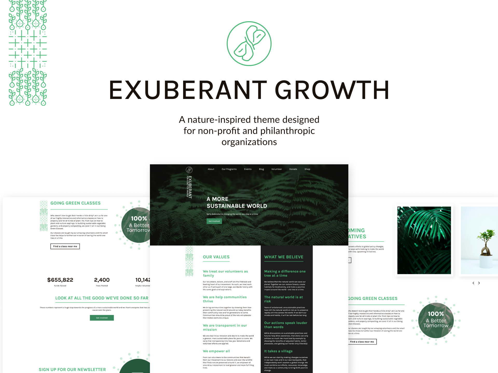

<h1 align="center">EXUBERANT GROWTH 🍀</h1>

  Exuberant Growth is a nature-inspired theme designed for non-profit and philanthropic organizations. This theme is designed to be vibrant, professional, and easy to use while still boasting page templates for volunteer sign-ups, donations, event sign-ups, and more.

  <a href="https://app.hubspot.com/l/ecosystem/marketplace/assets/themes/exuberant-growth-by-remotish?__hstc=129337491.8ddaef56dabb4e4d28d05be06832a72a.1649083040116.1651084187126.1651086231712.45&__hssc=129337491.4.1651086231712&__hsfp=471072775">Marketplace</a> |
  <a href="https://marketplace.remotish.agency/exuberant-theme">Demo website</a> |
  <a href="./LICENSE">License</a>

## Free and Open Source Theme
It's a free and open-source theme made by me and with help of Remotish Agency, designed in Figma to be modern, clean and developed with optimization in mind.

**The best features of this theme:**
 
- Fully responsive and mobile-friendly design
- Drag-and-drop modules
- Fully customizable
- Homepage template
- Landing page template
- Events page template
- Individual event registration page template
- Donation page template
- Volunteer sign-up page template
- Shopping page template
- About page template
- Blog listing template
- Blog post template
- All system page templates
- Product module
- Donation module
- Newsletter signup module
- Campaign and stat module
- Shopping module
- Video and image modules
- Contact Us module
- Frequently asked questions (FAQ) module
- Masonry gallery and gallery module
- Several text modules with buttons
- Customizable hero module
- Form module
- All modules are lazy load ready
- Free Google Fonts
- Native HubSpot design
- Built using a modern and professional design language
- Open-source theme

This theme incorporates the best practice recommendations and code formatting of the HubSpot CMS Boilerplate open-source theme.

## 📄 License

Permissions of this strong copyleft license are conditioned on making available complete source code of licensed works and modifications, which include larger works using a licensed work, under the same license. Copyright and license notices must be preserved. Contributors provide an express grant of patent rights.

| Permissions | Restrictions | Conditions
| --- | --- | --- 
&check; Commercial Use | &times; Liability | &#x1f6c8; License and Copyright Notice
&check; Modification   | &times; Warranty | &#x1f6c8; State changes
&check; Distribution |  | &#x1f6c8; Disclose source
&check; Patent Use |  | &#x1f6c8; Same license
&check; Private Use
